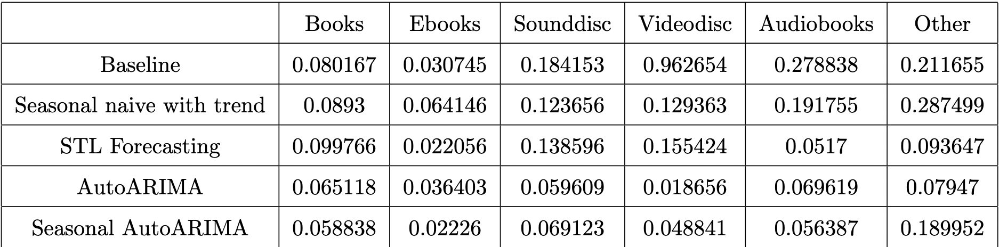

# Seattle Library Checkouts

Deep Learning Project for the Erdős Institute, Fall 2024.

James Cameron | Pradyut Karmakar | Kaitlynn Lilly | Danielle Reagan | Josey Wright

## Introduction
This project aims to develop predictive insights into library book checkouts using machine learning and time series analysis. Leveraging the ``Checkouts by Title" dataset provided by the Seattle Public Library, our analysis addresses two main questions: (1) can we predict the number of checkouts in the first year for a new book based on a number of features, and (2) can we forecast future checkouts over several months by analyzing past checkout patterns?

Both questions have implications for both inventory management and future acquisitions. Our first question aims to help libraries, bookstores, and publishers determine the number of copies of a new book they should buy/release. Our time series forecasting will help these same stakeholders estimate demand, supporting strategic planning for resource allocation. 

## Data Cleaning and Exploratory Data Analysis

### First Year Checkouts
Working with such a large dataset that included over 45 million entries introduced challenges, particularly in processing speed and memory limitations. We mitigated this by filtering out non-English titles and records with significant missing data. Though we initially hoped to use ISBNs as unique identifiers, inconsistencies rendered this unfeasible. Without a single unique identifier across columns, we developed alternative approaches to track items accurately.

From the "Checkouts by Title" data set, we opted to keep the following key features to examine, focusing on fields essential to our questions about checkout patterns: Usage class (Physical vs. Digital), Material Type (Book, Sound disc, Audiobook, Ebook, Video disc, Other), Checkout year, Checkout month, Checkouts, Title, Creator, Subjects, and Publisher. Author names and book titles were standardized for consistency, and we categorized books by genre using text analysis on the subjects provided. To establish the number of checkouts in a book's first year, we segmented the data by checkout dates, noting that later records exhibited inconsistencies. Initial visualizations revealed unreliability in these periods, leading us to exclude data from certain time ranges.

To enhance our predictive capabilities, we created an additional feature to quantify author popularity. For each book, we calculated the total number of checkouts and mean number of checkouts for the author’s other works in the year preceding the book’s release. These features provide a measure of prior popularity, helping us assess whether an author’s established readership correlates with the initial demand for new titles. By incorporating these popularity metrics, we aim to improve the accuracy of our first-year checkout predictions.

Our exploratory data analysis highlighted minimal overarching trends across the chosen features, underscoring the complexity and diversity in library checkouts. We anticipated that author popularity, as measured by the total and mean checkouts of an author’s previous works, would be a strong predictor of a new book's first-year checkouts. However, our analysis revealed no significant correlation between these variables, challenging our initial expectations. Figure\ref{fig:NoCorrelation} illustrates this lack of relationship, showing scattered data points with no clear trend, suggesting that factors beyond an author’s past popularity may play a larger role in predicting initial demand for new titles.

*Figure 1: Log scale plot of total checkouts in the first year of release for books at the Seattle Public Library versus number of checkouts by the author of the book in the previous year. Note that the color of each point corresponds to the material type of the book. It is clear that there is no correlation here for any material type.*

### Time Series Data
For our time series analysis, we aggregated the total number of checkouts per month across the entire dataset. To gain deeper insights, we also categorized this data by material type, allowing us to observe monthly trends within specific categories.

An initial visualization of this data is shown in Figure 2 reveals distinct patterns in checkout trends over time for each material type. Notably, a sharp decline is visible during the early months of the COVID-19 pandemic, reflecting reduced access to physical library resources. In contrast, digital materials saw less of an impact during this period, illustrating a shift in user behavior when physical access was limited. In fact, digital media such as Ebooks appear to exponentially grow over time, suggesting the rise in digital media post pandemic. This trend provides valuable context for our forecasting models, as it highlights both long-term patterns and temporary disruptions that influence overall checkout behaviors.

Our ACF and PACF analysis of the time series data indicated nonstationarity in all materials as well as a seasonal pattern, where checkouts are correlated with data from approximately a year prior. This repeating cycle suggests that library checkouts follow predictable annual trends. This autocorrelation at yearly intervals informs our forecasting approach, as it highlights the importance of past seasonal patterns in predicting future checkout behavior for various material types.

*Figure 2: Plot of the total number of checkouts at the Seattle Public Library over time. Note that the colors of each line indicate the material type of books. Also note the effects of the COVID-19 pandemic from 2019-2021.* 

## Modeling Approach

### First Year Checkouts
Our baseline model, used to establish a reference point for prediction accuracy, was chosen to be the average number of checkouts in the first year for all books in the training set. This value turned out to be approximately 116 checkouts and was used as the predicted number of first year checkouts, regardless of book. Such a choice of baseline provides a straightforward metric for comparison.

To improve upon this baseline, we applied a variety of regression models to capture relationships between the features and target variable. We experimented with multiple regression techniques, including linear regression with and without lasso regularization, random forest (RF), extra trees, k-nearest neighbors (KNN), XGBoost, and a simple neural network. Each model was selected to test different ways of handling feature relationships and regularization, providing further insights into model performance and refinement.

### Time Series Data
We used a linear regression model as a baseline to establish an initial predictive framework for the time series. This baseline provides a simple trend line to gauge the general direction of monthly checkouts over time, helping us identify if more complex models can yield improvements. We also included a more robust baseline model that accounts for seasonality known as "seasonal naive with trend". 

To capture the seasonality and autocorrelation observed in the data, we also experimented with an AutoARIMA model. This model dynamically selects the best-fitting parameters for autoregressive and moving average components, allowing it to adapt to seasonal patterns and more complex dependencies in the data. For our first model, we applied AutoARIMA without accounting for seasonality to each time series without any changes. To achieve more stationary results, for our second model, we subtracted off the trend in our data before applying AutoARIMA, in this case allowing for seasonality. We determined the trend by fitting our data using b-splines. Comparing AutoARIMA’s performance against the linear regression baseline enables us to evaluate how well each approach captures the nuanced temporal patterns in library checkouts.

We then compared our results obtained by removing the trend ourselves to those obtained using the time series analysis (tsa) functionality built into statsmodels in Python, specifically the STL method ("Seasonal and Trend decomposition using Loess”).  STL is a versatile and robust method for decomposing time series, leveraging Loess—a technique for estimating nonlinear relationships. This method was originally developed by R. B. Cleveland, Cleveland, McRae, and Terpenning in 1990. To forecast, we use the built in STLForecast model, which first subtracts the seasonality estimated using STL, forecasts the deseasonalized data using ARIMA, forecasts the seasonality under the assumption that future seasonal components will repeat the last observed seasonal cycle, and adds the deseasonalized and seasonal predictions together to get the final forecast.
## Results

### First Year Checkouts
The iterative modeling approach described above allowed us to evaluate the effectiveness of each model to outperform the baseline and refine our predictive techniques. The root-mean-square error (RMSE) on the training set for each of the models is included in Table 1. We can see that XGBoost performs the best of all the models tested. For this reason, we chose to test XGBoost on the test set.

*Table 1: Root-mean-square error for several different regression models on the training data.* 

When evaluated on the test set, we found that the baseline model had a RMSE of 119.1516, while XGBoost had a RMSE of 115.6487. The marginal performance boost of our machine learning model on the data would likely not be worth the added complication for libraries and bookstores to predict the popularity of a book in the first year of release. 

### Time Series Data
While we did not have success with predicting the number of checkouts in the first year a book is released, we had more success predicting the total number of checkouts in future years. The relative error for each of the models described above is shown in Table 2. Note that we evaluated each of these models on each material type. This is because each material type displayed vastly different trends as can be seen in Figure 2. 

*Table 2: Relative error for several different time series models on the training data for each material type.*

From Table 2, we can see that STL forecasting performed the best for Ebooks and audiobooks, AutoARIMA performed the best for sounddiscs, videodiscs, and other, and seasonal AutoARIMA performed the best on books. We then used each of these respective models on the test set for the appropriate material types. However, it is important to note that every time we run these models on the training set, the results vary slightly as to which model performs the best. The results presented here are merely one run. The results from this run on the test set are shown in Table 3. We can see that our models far outperform the baseline. This can further be seen by Figure 3, which is a plot of the predictions and the true number of checkouts for one year out in the future. From Figure 3, we can see that our model predicts the total number of checkouts per month extremely well. 

*Table 3: Relative error for the optimal respective time series models on the test data for each material type.*

*Figure 3: Plot of model predictions for total number of checkouts per month versus true values over one year.*

